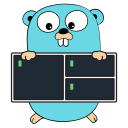

<a href="https://github.com/zigai/gotmux"></a>

# gotmux

gotmux is a Go library for controlling, inspecting, and automating [tmux](https://github.com/tmux/tmux) sessions, windows, panes, and buffers.

[](https://github.com/zigai/gotmux/actions/workflows/test.yml)
[](https://github.com/zigai/gotmux/releases/latest)
[](https://pkg.go.dev/github.com/zigai/gotmux/tmux)
[](https://github.com/zigai/gotmux/blob/master/go.mod)
[](https://github.com/zigai/gotmux/blob/master/LICENSE)

## Features

- **Deep tmux coverage:** Controls sessions, windows, shared window links, pane splits, layouts, paste buffer stacks, and terminal history capture.
- **Control mode streaming:** Connects to tmux using control mode (`-C` and `-CC`) for real-time event notifications, live terminal output streaming, and interactive automation without polling.
- **Typed options:** Reads and sets over 100 native tmux options and custom `@user` options using native Go types across server, session, window, and pane scopes.
- **Environment discovery:** Detects the current session, window, and pane directly from ambient `$TMUX` and `$TMUX_PANE` environment variables.
- **Testing fixtures:** Launches isolated, temporary tmux instances through `tmuxtest` with clean environments for integration testing.

## Installation

```sh
go get github.com/zigai/gotmux
```

Requires Go 1.26+ and tmux 3.2+.

## Examples

### Session, window, and pane automation

```go
ctx := context.Background()

server, err := tmux.New(tmux.Config{SocketName: "dev"})
if err != nil {
	log.Fatal(err)
}

session, err := server.NewSession(ctx, tmux.NewSessionOptions{Name: "dev"})
if err != nil {
	log.Fatal(err)
}

if err := session.Options().SetMouse(ctx, true); err != nil {
	log.Fatal(err)
}

link, err := session.NewWindow(ctx, tmux.NewWindowOptions{
	Name:    "editor",
	Program: tmux.Exec("vim", "main.go"),
})
if err != nil {
	log.Fatal(err)
}

activePane, err := link.Window().ActivePane(ctx)
if err != nil {
	log.Fatal(err)
}

_, err = activePane.Split(ctx, tmux.SplitOptions{
	Direction: tmux.Horizontal,
	Size:      tmux.SplitSize{Percent: 30},
})
if err != nil {
	log.Fatal(err)
}
```

### Real-time control mode streaming

```go
ctx := context.Background()

server, err := tmux.New(tmux.Config{SocketName: "dev"})
if err != nil {
	log.Fatal(err)
}

session, err := server.FindSession(ctx, "dev")
if err != nil {
	session, err = server.NewSession(ctx, tmux.NewSessionOptions{Name: "dev"})
	if err != nil {
		log.Fatal(err)
	}
}

conn, err := server.OpenControl(ctx, session, tmux.ControlOptions{PaneOutput: false})
if err != nil {
	log.Fatal(err)
}
defer conn.Close()

stream, err := conn.Events(ctx, tmux.EventOptions{})
if err != nil {
	log.Fatal(err)
}
defer stream.Close()

for {
	event, err := stream.Next(ctx)
	if err != nil {
		break
	}
	fmt.Printf("Notification: %s\n", event.RawName())
}
```

### Ambient environment discovery

```go
ctx := context.Background()

current, err := tmux.Current(ctx)
if err != nil {
	if errors.Is(err, tmux.ErrNotInsideTmux) {
		fmt.Println("Process is not running inside tmux")
	}
	return
}

fmt.Printf("Current pane %s in window %s\n", current.Pane.ID, current.Window.Name)
```

### Testing fixtures (tmuxtest)

```go
package myapp_test

import (
	"testing"

	"github.com/zigai/gotmux/tmuxtest"
)

func TestMyTmuxIntegration(t *testing.T) {
	// Starts an isolated tmux daemon and registers cleanup via t.Cleanup.
	server := tmuxtest.NewServer(t)

	sessions, err := server.Sessions(t.Context())
	if err != nil {
		t.Fatalf("listing sessions: %v", err)
	}
	if len(sessions) == 0 {
		t.Fatal("expected at least one fixture session")
	}
}
```

## License

[MIT](LICENSE)
